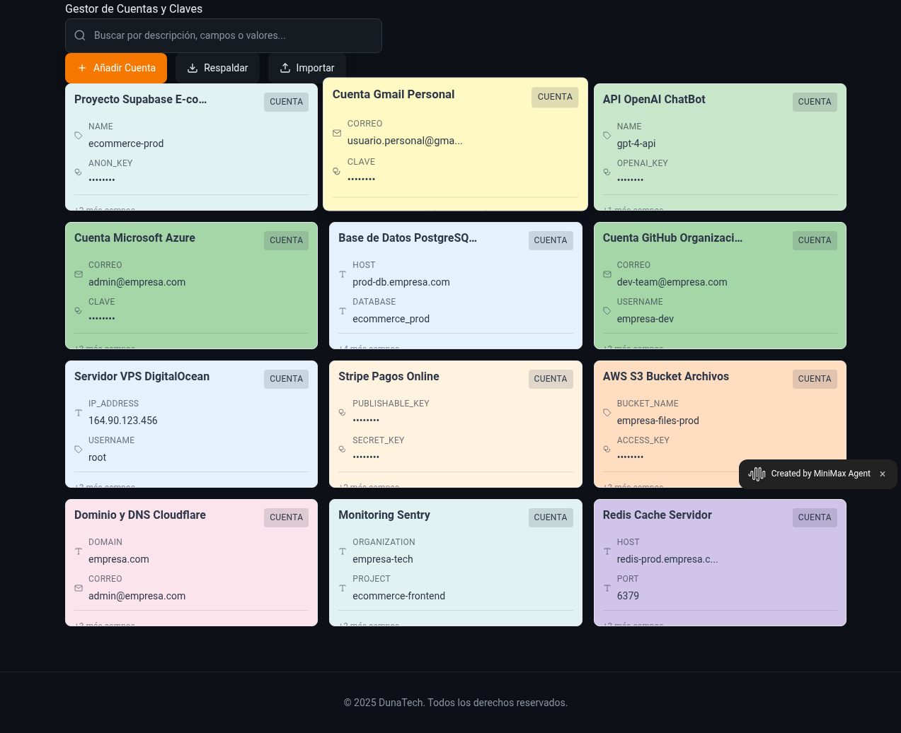

# Gestor Local de Cuentas, Claves y API Keys - DunaTech

[](https://w7n2powvrmo0.space.minimax.io)

> **Aplicación web moderna para gestionar de forma segura tus credenciales, contraseñas y API keys localmente, sin necesidad de servidores externos.**

## 🌟 Características Principales

- 🔒 **100% Local**: Todos los datos se almacenan localmente en tu navegador
- 🎨 **Diseño Moderno**: Interfaz elegante con tema oscuro y colores pastel únicos
- 🔍 **Búsqueda Inteligente**: Encuentra rápidamente cualquier cuenta o servicio
- 📱 **Responsive**: Funciona perfectamente en dispositivos móviles y desktop
- 🛡️ **Seguro**: Contraseñas ocultas por defecto con opción de mostrar
- 📤 **Backup/Restore**: Exporta e importa tus datos de forma segura
- ⚡ **Campos Dinámicos**: Añade campos personalizados según tus necesidades
- 🎯 **Modal de Detalles**: Vista completa al hacer click en cualquier tarjeta

## 🚀 Demo en Vivo

**[👉 Ver Aplicación en Funcionamiento](https://w7n2powvrmo0.space.minimax.io)**

## 📸 Capturas de Pantalla

### Vista Principal


*La aplicación muestra un grid compacto de tarjetas con colores pastel únicos para cada cuenta, búsqueda avanzada y botones de acción modernos.*

## 🛠️ Instalación y Uso

### Requisitos
- Navegador web moderno (Chrome, Firefox, Safari, Edge)
- JavaScript habilitado
- Soporte para LocalStorage

### Instalación Local

1. **Clona este repositorio:**
   ```bash
   git clone https://github.com/Miltondz/gestor-claves-dunatech.git
   cd gestor-claves-dunatech
   ```

2. **Abre la aplicación:**
   - Simplemente abre `index.html` en tu navegador
   - O usa un servidor local:
     ```bash
     # Con Python
     python -m http.server 8000
     
     # Con Node.js (http-server)
     npx http-server
     
     # Con PHP
     php -S localhost:8000
     ```

3. **¡Listo!** La aplicación estará funcionando localmente.

## 📁 Estructura del Proyecto

```
gestor-claves-dunatech/
├── index.html          # Página principal con estructura HTML
├── style.css           # Estilos CSS con tema oscuro y colores pastel
├── app.js             # Lógica de la aplicación (CRUD, búsqueda, modales)
├── data.json          # Datos de ejemplo (con prefijo DEMO_ para seguridad)
├── screenshots/       # Capturas de pantalla de la aplicación
└── README.md          # Este archivo
```

## 🎯 Funcionalidades Detalladas

### ➕ Gestión de Cuentas
- **Añadir:** Botón "Nueva Cuenta" para crear entradas
- **Editar:** Click en el icono de edición para modificar
- **Eliminar:** Botón de eliminación con confirmación
- **Campos Dinámicos:** Correo, Contraseña, Nombre, Enlace

### 🔍 Búsqueda Avanzada
- Búsqueda en tiempo real por cualquier campo
- Resaltado de coincidencias en las tarjetas
- Interfaz moderna con icono integrado

### 🎨 Diseño Visual
- **30 Colores Pastel Únicos:** Cada tarjeta tiene un color distintivo
- **Grid Compacto:** Optimizado para mostrar más información
- **Modal de Detalles:** Vista completa al hacer click
- **Animaciones Suaves:** Transiciones y efectos hover

### 💾 Backup y Sincronización
- **Exportar:** Descarga archivo JSON con todos tus datos
- **Importar:** Restaura desde archivo de backup
- **Formato Estándar:** JSON legible y portable

### 🔐 Seguridad y Privacidad

#### ⚠️ **IMPORTANTE: Datos de Ejemplo**
Todos los datos incluidos en `data.json` son **EJEMPLOS DEMOSTRATIVOS** y están marcados con el prefijo `DEMO_`:
- `DEMO_sk-proj-abc123def456...` - API Key de OpenAI (FALSA)
- `DEMO_pk-live-51abc123...` - Clave de Stripe (FALSA)
- `DEMO_GitHubToken456$` - Token de GitHub (FALSO)

**🚨 Nunca uses estas claves en producción - son solo para demostración.**

#### 🛡️ Características de Seguridad
- **Almacenamiento Local:** Tus datos nunca salen de tu dispositivo
- **Contraseñas Ocultas:** Se muestran como `••••••••` por defecto
- **Sin Conexión Externa:** No requiere internet una vez cargada
- **Datos Encriptados:** LocalStorage protegido por el navegador

## 🖱️ Guía de Uso

### Añadir Nueva Cuenta
1. Click en "Nueva Cuenta"
2. Introduce descripción (obligatorio)
3. Añade campos según necesites (Correo, Clave, Nombre, Enlace)
4. Click "Guardar"

### Ver Detalles Completos
1. Click en cualquier tarjeta
2. Se abre modal con información completa
3. Puedes copiar cualquier campo
4. Opción de editar directamente

### Realizar Backup
1. Click en "Respaldar"
2. Se descarga archivo JSON automáticamente
3. Guarda el archivo en lugar seguro

### Restaurar desde Backup
1. Click en "Importar"
2. Selecciona archivo JSON de backup
3. Confirma la importación
4. Tus datos se restauran instantáneamente

## 🎨 Personalización

### Colores de Tarjetas
La aplicación asigna automáticamente uno de 30 colores pastel únicos a cada tarjeta basado en un hash del ID. Los colores incluyen:
- Rosas, naranjas, amarillos
- Verdes, azules, púrpuras
- Tonos suaves y legibles

### Campos Personalizados
Puedes añadir tantos campos como necesites:
- **Correo:** Para cuentas de email
- **Clave:** Contraseñas y tokens (se ocultan automáticamente)
- **Nombre:** Identificadores o nombres de usuario
- **Enlace:** URLs de login o documentación

## 🌐 Compatibilidad

### Navegadores Soportados
- ✅ Chrome 90+
- ✅ Firefox 88+
- ✅ Safari 14+
- ✅ Edge 90+

### APIs Utilizadas
- **LocalStorage API:** Persistencia de datos
- **Clipboard API:** Funciones de copiar/pegar
- **File API:** Importar/exportar archivos
- **CSS Grid & Flexbox:** Layout responsive

## 🚨 Solución de Problemas

### La aplicación no carga
- **Verifica:** JavaScript habilitado en el navegador
- **Solución:** Abre las herramientas de desarrollador (F12) y revisa errores

### No puedo copiar al portapapeles
- **Causa:** Clipboard API no disponible
- **Solución:** Usa HTTPS o localhost

### Los datos no se guardan
- **Causa:** LocalStorage bloqueado o lleno
- **Solución:** Revisa configuración de privacidad del navegador

### El backup no se descarga
- **Causa:** Pop-ups bloqueados
- **Solución:** Permite descargas para este sitio

## 🤝 Contribuciones

Las contribuciones son bienvenidas. Para cambios importantes:

1. Fork el repositorio
2. Crea una rama para tu feature (`git checkout -b feature/AmazingFeature`)
3. Commit tus cambios (`git commit -m 'Add some AmazingFeature'`)
4. Push a la rama (`git push origin feature/AmazingFeature`)
5. Abre un Pull Request

## 📄 Licencia

Este proyecto está bajo la Licencia MIT. Ver el archivo `LICENSE` para más detalles.

## 📞 Contacto y Soporte

**DunaTech** - Desarrollador: Milton  
**GitHub:** [@Miltondz](https://github.com/Miltondz)  
**Proyecto:** [gestor-claves-dunatech](https://github.com/Miltondz/gestor-claves-dunatech)

---

### 🏆 Características Destacadas

- 🎯 **Grid Compacto:** Diseño optimizado que muestra más información en menos espacio
- 🌈 **30 Colores Únicos:** Cada cuenta tiene su propio color pastel distintivo
- 🔍 **Búsqueda Moderna:** Con icono integrado y efectos visuales profesionales
- 📱 **100% Responsive:** Perfecta experiencia en móviles, tablets y desktop
- ⚡ **Modal Inteligente:** Vista detallada instantánea con un solo click
- 🛡️ **Seguridad por Diseño:** Datos locales, contraseñas ocultas, sin servidores

---

**© 2025 DunaTech. Todos los derechos reservados.**

*Gestor de Claves local, seguro y moderno para profesionales y equipos.*